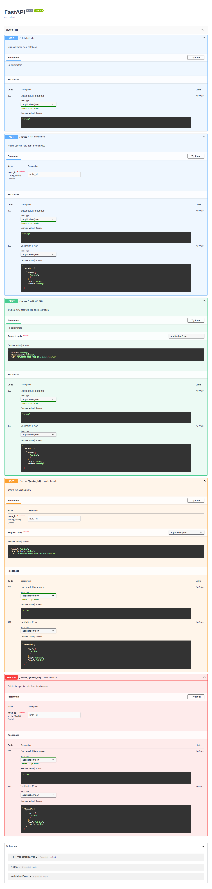

# 📝 FastAPI CRUD Notes App

A simple Note-Taking REST API built using **FastAPI**, storing notes in-memory using Python dictionaries. The app supports basic CRUD (Create, Read, Update, Delete) operations and uses UUIDs for note identification.

---

## 🚀 Features

- Create a new note
- Retrieve all notes
- Retrieve a specific note by UUID
- Update a note
- Delete a note
- Auto-generated API documentation using **Swagger UI** (`/docs`)
- In-memory storage using Python dictionary

---

## 📦 Requirements

- Python 3.10+
- FastAPI
- Uvicorn
- Pydantic

### Install dependencies:
```bash
pip install -r requirements.txt
```

## Running the App

```bash
uvicorn main:app --reload
```

## API Documentation

 http://127.0.0.1:8000/docs

## Postman Collection

You can test the API using the included Postman collection file: [Click Here](06_note_api/CRUD_NOTES.postman_collection.json)
# Sample Request/Response

## POST /notes/

### Request Body:

```json

{
  "title": "Meeting Notes",
  "content": "Discuss FastAPI features",
  "id": null
}
```
### Response:
```json
{
  "Message": "Note Added Successfully",
  "note_id": "3fa85f64-5717-4562-b3fc-2c963f66afa6"
}
```
## SCREENSHOT

Swagger UI /docs route showing all endpoints: 


## KNOWN LIMITATIONS

- Notes are stored in-memory (dictionary), so they are lost when the server restarts.

- No persistent database (e.g., SQLite, PostgreSQL) used.